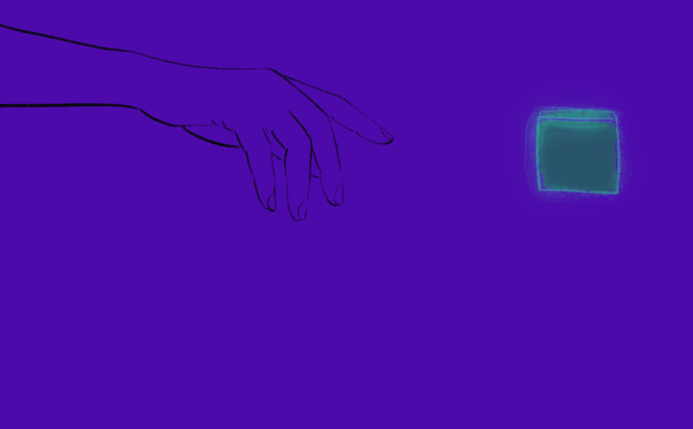

# Abstract Ideas for 4E+ Interaction Design: Conscious Particles

## Introduction
This research explores designing XR interactions inspired by **autopoiesis** and **symbiosis**, drawing on biological principles and 4E+ Cognition (embodied, embedded, enactive, extended, and affective cognition). By treating virtual objects as life-like entities, the design fosters a responsive, symbiotic relationship between users and virtual environments.

## Inspiration and Framework
Key influences include:
- **Jeffrey Ventrella’s Clusters Project**: Uses algorithms inspired by Lynn Margulis's endosymbiosis theory, simulating life-like behaviours in particle systems.
- **Lynn Margulis’s Endosymbiosis Theory**: Highlights cooperation and integration in evolution, which inspires designing XR systems as adaptive, interconnected ecosystems.
- **4E+ Cognition**: Incorporates affective dimensions to create immersive, emotionally engaging experiences.

## Design Principles
1. **Life-like Interaction**: Virtual environments mimic living systems, promoting dynamic, reciprocal interactions.
2. **Emotionally Engaging Systems**: Interaction design integrates emotional responses to foster intuitive and meaningful experiences.
3. **Symbiotic Dynamics**: Inspired by biological symbiosis, XR environments evolve with user interaction.

## Implementation: Smart Particles
### Features
- **Responsive Behaviour**: Particles react dynamically to user movements, offering real-time feedback.
- **Adaptability via Machine Learning**: Smart particles learn user preferences and adapt behaviours for personalised interaction.
- **Emotional Engagement**: Particles use visual and behavioural cues (e.g., glowing, colour changes) to evoke curiosity and delight.

### Interaction Example
When users approach or touch virtual objects:
- Objects detect intent (engage or bypass) and respond with animations.
- Smart particles dynamically react to gestures, enhancing immersion.

## Theoretical Applications
- **4E+ Cognition Integration**: Grounding interactions in embodied, enactive, and extended cognition for a natural, intuitive experience.
- **Extended Presence**: XR becomes an extension of cognitive processes, enriching user engagement.
- **Affective Design**: Emotional responses deepen connection and sustain interest.

## Future Directions
- **Enhanced ML Capabilities**: Reinforcement learning to refine particle behaviours based on user feedback.
- **Natural Language Processing (NLP)**: Smart particles responding to voice commands for greater accessibility.
- **Emotion Detection**: Particles adapting to user emotional states via physiological or vocal cues.

## Conclusion
This approach advances XR by integrating **biological principles**, **4E+ Cognition**, and **machine learning**, enabling dynamic, adaptive environments that resonate with human cognitive and emotional processes. By fostering life-like interactions, these systems push the boundaries of immersive design, creating transformative user experiences.
